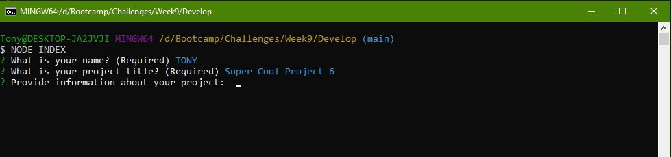

# Professional README Generator
The purpose of this challenge is to create a node application that allows users to input information for a new project they're making and have the application create a professional, high quality README file to be included with the new project.

## Table of Contents
* [Criteria](#Criteria)
* [Tools used](#Tools-used)
* [Contributions](#Contributions)
* [Final Result](#Final-Result)

### Criteria
* Command-line application
* Prompts user for project information
    * Creates README file after information inputted 
* Requirements of README file
    * Project title
    * Description
    * Table of Contents
    * Installation
    * Usage
    * License (if applicable)
    * Contributors
    * Tests
    * Questions
* Project title is title of README
* Information added to each requested section as it is inputted
* License from list of options
    * Badge of the chosen license displayed at top
    * Information about license coverage
* GitHub username added to Questions section with link to profile
* Email added to Questions section as form of contact
* Table of Contents is made up of links that redirect to each section

### Tools Used
* Node.js
* JavaScript

## Contributions
Designed by Tony Huang

## Final Result
### Command-line application prompts

### Link to video of README creation
<a href='https://youtu.be/oOE5FoG8vuM' target='_blank'>Application live test</a>
